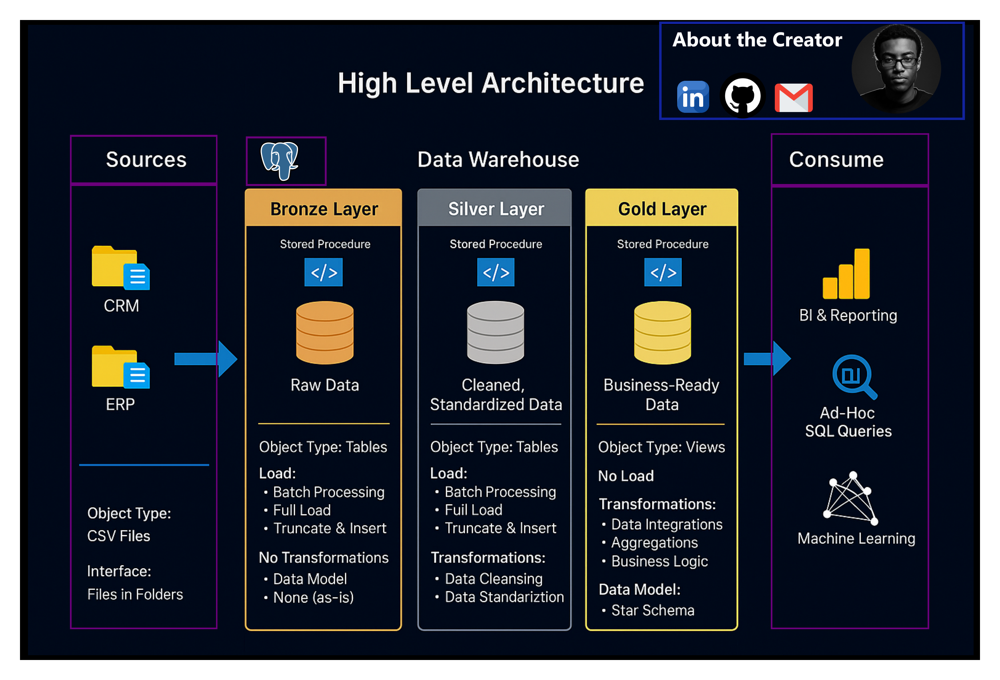

# 🧠 Data Warehouse and Analytics Project (PostgreSQL Edition)

Welcome to the **Data Warehouse and Analytics Project** repository! 🚀  
This project demonstrates a full-stack modern data warehouse solution using **PostgreSQL**, built on the Medallion architecture (Bronze, Silver, Gold layers). Designed for portfolio and real-world readiness, it features best practices in **Data Engineering**, **ETL**, **Data Modeling**, and **Analytics**.

---

## 🏗️ Data Architecture: Medallion Layers

This project is structured using the **Medallion Architecture**:



1. **Bronze Layer**: Ingests and stores raw data directly from CSV files into PostgreSQL using `COPY` statements.
2. **Silver Layer**: Performs transformations—such as cleansing, standardizing, and joining—to produce cleaned relational tables.
3. **Gold Layer**: Models the final star schema using **PostgreSQL views** for analytics and BI.

---

## 📖 Project Highlights

This project includes:

1. ✅ **Modern Data Architecture**: PostgreSQL with layered Medallion design.
2. ✅ **ETL Process Automation**: Through **stored procedures** (`plpgsql`) for Bronze and Silver loading.
3. ✅ **Data Modeling**: Structured star schema with dimensions and facts in the Gold layer.
4. ✅ **Analytics-Ready**: Business-ready data for reporting and visual insights.

🎯 Ideal for showcasing skills in:
- SQL & PostgreSQL Development  
- Data Engineering & ETL Automation  
- Data Modeling (Star Schema)  
- BI Readiness for Reporting & Dashboards

---

## 🛠️ Tools & Resources

Everything used here is free and open-source:

- 📂 **[Datasets](datasets/)** – CRM & ERP CSV files used in Bronze layer
- 🐘 **[PostgreSQL](https://www.postgresql.org/download/):** Relational DBMS used across all layers
- 🧠 **pgAdmin / DBeaver** – GUI tools to interact with PostgreSQL
- 🧠 **[Git Repository](https://github.com/):** Set up a GitHub account and repository to manage, version, and collaborate on your code efficiently.
- 📝 **[DrawIO](https://www.drawio.com/):** – Data architecture and flow diagrams


---

## 🚀 Project Scope & Deliverables

### 🏗️ Data Warehouse Development (Data Engineering)

**Objective:**  
Build a robust PostgreSQL data warehouse that consolidates customer, sales, and product data.

**Key Tasks:**
- ✅ Ingest CSVs from ERP & CRM (Bronze)
- ✅ Clean & transform into structured relational models (Silver)
- ✅ Model dimensions and facts for analytics (Gold)

**Data Quality Goals:**
- Remove duplicates
- Normalize inconsistent values
- Convert datatypes (dates, codes)
- Ensure referential integrity

---

### 📊 Analytics & Insights (Data Analysis)

**Objective:**  
Enable reporting on customer behavior, product performance, and sales trends.

**Data Model:**
- **Gold Layer** with:
  - `dim_customers`
  - `dim_products`
  - `fact_sales`

**Outputs:**
- SQL queries for insights
- BI-ready dataset (Gold views)

Refer to [docs/data_catalog.md](docs/data_catalog.md) for full metadata.

---

## 📁 Repository Structure

```
sql-data-warehouse-project/
│
├── datasets/                           # Raw datasets used for the project (ERP and CRM data)
│
├── docs/                               # Project documentation and architecture details
│   ├── etl.drawio                      # Draw.io file shows all different techniquies and methods of ETL
│   ├── data_architecture.drawio        # Draw.io file shows the project's architecture
│   ├── data_catalog.md                 # Catalog of datasets, including field descriptions and metadata
│   ├── data_flow.drawio                # Draw.io file for the data flow diagram
│   ├── data_models.drawio              # Draw.io file for data models (star schema)
│   ├── naming-conventions.md           # Consistent naming guidelines for tables, columns, and files
│
├── scripts/                            # SQL scripts for ETL and transformations
│   ├── bronze/                         # Scripts for extracting and loading raw data
│   ├── silver/                         # Scripts for cleaning and transforming data
│   ├── gold/                           # Scripts for creating analytical models
│
├── tests/                              # Test scripts and quality files
│
├── README.md                           # Project overview and instructions
├── LICENSE                             # License information for the repository
├── .gitignore                          # Files and directories to be ignored by Git
```
## ☕ Stay Connected

Let’s connect! 

[](https://linkedin.com/in/robel-ermiyas)

---
